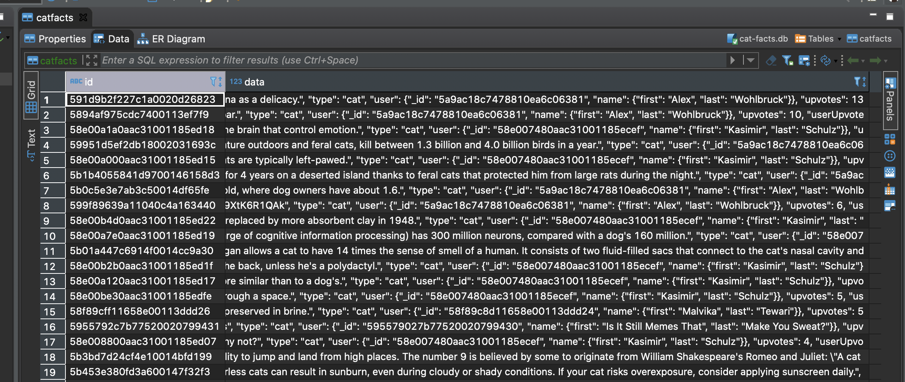

# cat-facts

Completed the task as far as the CLI

Planned to use a flat file db to implement query and delete functionality

Started running out of time so DB is only loaded with facts from api

My implemented api for viewing facts is fully functional and runs on localhost:5000 when the script is active

A query flag can be passed to the the cli which will query the localhost api: 

#### python3 catcli.py --query delete

---

### NOTE DB is pushed to this repo but will be recreated and loaded if deleted

screenshot of loaded db:

